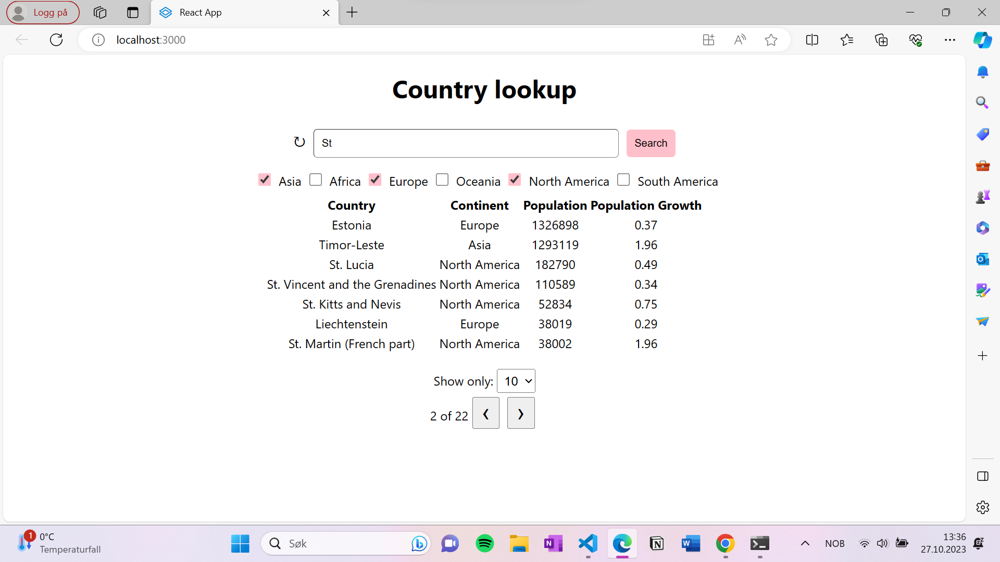
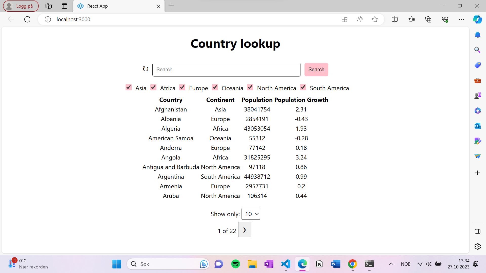

# Description
- Instructions on running app
- Visuals of the app

## How to run the app

Make sure node and yarn is installed:
https://nodejs.org/en/download
Run `npm install -g yarn` in terminal
(Npm is necessary here, should be installed along with Node)


1. Create React app: https://github.com/facebook/create-react-app
or clone this repo
```
git clone https://github.uio.no/alexanrf/in5320-assignment2
```

2. Replace the included src directory with my src dir

3. Change directory to where the yarn.lock file is.
`cd your_react_app`
Run `yarn start`


## Visuals

Homepage of the app


Page when filtered with search and continents, and sorted by Population



